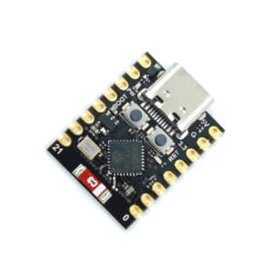

# Rust ESP32 experiments

This project is a sandbox to discover how to program an ESP32 in Rust with rust-hal lib.

## Device

I use an ESP32 C3 like this one : 



## Experiments

### Blink the internal board LED

```rs
let peripherals = esp_hal::init({
    let mut config = esp_hal::Config::default();
    config.cpu_clock = CpuClock::max();
    config
});

// Internal LED GPIO is GPIO8
let mut led = Output::new(peripherals.GPIO8, Level::High);

let delay = Delay::new();
loop {
    led.toggle(); // change LED state
    delay.delay_millis(1000);
}
```